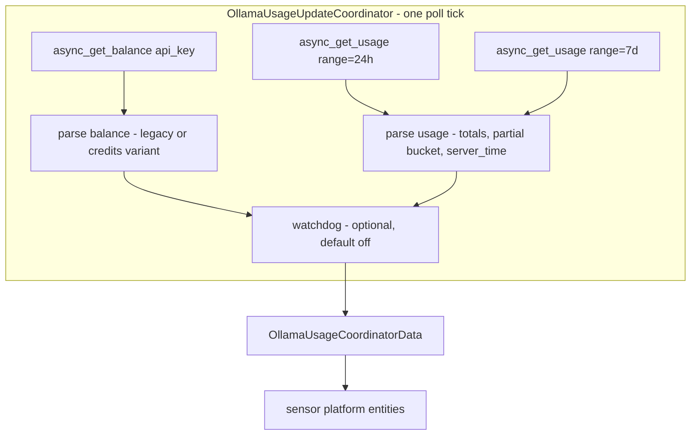

# v0.3 Plan — Endpoint Migration: `/api/balance` + `/api/usage?range=24h`

Repo: `/workspaces/AX-Ollama-Usage-Tracker` · Integration: `custom_components/ax_ollama_usage/`
Status: PLAN rev 2 — audit amendments applied; awaiting approval before switching to Code mode.

---

## 1. Background — what changed

The single undocumented `GET /api/usage` payload (`limits.{window}.usage` fractions + `activity.cost`) is **gone**. The live-validated v0.3 API (2026-10-07) is two documented endpoints (OpenAPI specs at docs.ollama.com/api/balance.md and docs.ollama.com/api/cloud-usage.md):

1. **`GET https://ollama.com/api/balance`** — no query params (server returns 400 if any are sent).
2. **`GET https://ollama.com/api/usage?range=24h`** — `range` ∈ {24h, 7d, 30d}; granularity server-set (hour for 24h, day for 7d/30d); `scope` optional ∈ {self, team}. We request `range=24h` and `range=7d` (see §5 decision D9).

Both: `Authorization: Bearer <api_key>` + `Accept: application/json`. Three GETs per poll tick → 0.6 req/min at the default 300 s interval vs the documented 10 req/min/user cap — fine, including multi-account.

Refuted paths (do not use): `/api/usage/balance`, `/api/limits`, `/api/quota`, `/api/account`, `/api/user`, `/api/usage/limits` (all 404), `/api/me` (405, abandoned), `?type=balance` params.

### Canonical fixtures (verbatim, live-validated 2026-10-07 — become test fixtures)

**Balance, legacy branch (this account today):**
```json
{"included":{"session":{"remaining_percent":98.77,"resets_at":"2026-10-07T08:00:00Z"},
"weekly":{"remaining_percent":67.54,"resets_at":"2026-10-12T00:00:00Z"}},
"purchased":{"balance_usd":0}}
```

**Balance, credits branch (docs' `oneOf` example — the account already schema-flipped once, Oct 6, without notice):**
```json
{"included": {"balance_usd": 72.5, "allowance_usd": 100,
  "period": {"from": "2026-09-15T09:30:00Z", "until": "2026-10-15T09:30:00Z"}},
 "purchased": {"balance_usd": 25}}
```

**Usage 24h:** `granularity=hour`, 25 buckets (24 complete zero-filled + final `partial:true`), `from` = 24 h before start of current UTC hour, `totals = {"request_count": 327}` with **NO** `usage_usd`/`input_tokens` (legacy plans omit them). Full verbatim sample (per-bucket `from`/`until`/`request_count`, final bucket `{"from":"2026-10-07T03:00:00Z","until":"2026-10-07T03:17:54.970791219Z","partial":true,"request_count":7}`) captured in this task's Q&A — to be pasted into `tests/conftest.py` as `SAMPLE_USAGE_24H`.

### Confirmed semantics (baked in — do not re-derive)

- `remaining_percent` = REMAINING (0–100). `used_pct = 100 − remaining_percent` so existing "Usage" sensor names and user automations keep their meaning.
- `purchased.balance_usd` arrives as a JSON number but must be parsed **str-or-number tolerantly** (this API family has mutated before). Same tolerance applies to credits-branch `balance_usd`/`allowance_usd`.
- `resets_at`: **passthrough, server-authoritative**. Cross-check vs the clock model passed live on both windows (08:00Z session lattice; 2026-10-12T00:00Z Monday weekly). Divergence flagging stays **default-off**; the server value always wins.
- Session model: **5-hour lattice anchored in EPOCH time** — `next_reset = ((now_epoch // 18000) + 1) * 18000` (strictly-greater ceil). `SESSION_BUCKET_SECONDS = 18000` unchanged. Because 5 h ∤ 24 h, boundaries drift 4 h earlier per day on a 5-day cycle (Oct 7 is a phase-3 day: 03/08/13/18/23Z — hence the live 08:00Z). **The existing implementation in `reset_math.py` is already epoch-anchored and correct** — only its docstring evidence and regression tests need updating. The 8-hour-lattice hypothesis is refuted (Sep 14 data-times 05:00Z/15:00Z; docs example 07:00Z; Oct 7 rollover 03:00Z).
- Per-model request sensors: **stay unavailable** — per-model breakdown is documented "coming soon"; do not fabricate from SSR data.
- **HTTP 429 carries `Retry-After`** (seconds) per both specs — must be honored (Amendment 1).
- **HTTP 403 = account suspended / team scope without admin** — a distinct state; the key is *valid*, so no reauth (Amendment 2).

---

## 2. Architecture



Poll tick = 3 GETs issued sequentially (simple, deterministic; no need for `asyncio.gather` at 0.6 req/min). Error mapping:

- **401** → `ConfigEntryAuthFailed` (reauth).
- **403** → `OllamaForbiddenError` → `UpdateFailed("Ollama account suspended or insufficient scope")` — sensors unavailable, **no reauth** (Amendment 2).
- **429** → `OllamaRateLimitError(retry_after=N)` → backoff uses exactly `retry_after` seconds (capped by `BACKOFF_MAX`); header absent → existing exponential path; never multiplied/compounded (Amendment 1).
- **network/timeout/5xx** → `UpdateFailed` (5xx keeps the exponential path).

If any GET fails mid-tick, the tick fails as `UpdateFailed` (partial data would produce flapping sensors) — but the successfully parsed payloads are kept in `self.data` so the next tick's watchdog has continuity.

### New coordinator data model

- `windows: dict[str, WindowData]` — dynamic keys from `balance.included` legacy branch (never hardcoded). `WindowData` fields: `remaining_percent: float`, `resets_at: datetime | None`, `raw_key: str`. (`models` field removed — no per-model data exists.)
- **Credits-branch fields** (Amendment 3): `included_balance_usd: float | None`, `allowance_usd: float | None`, `included_period_until: datetime | None`. On the credits branch `windows` is an **empty dict** (not absent) so legacy-window sensors report unavailable per the never-delete rule. Variant detection is tolerant by key shape: `"session" in included` or `"weekly" in included` → legacy; `"balance_usd" in included` → credits.
- `purchased_balance_usd: float | None` — tolerant str-or-number parse.
- `requests_24h: int | None` — `totals.request_count` from the 24h usage GET.
- `requests_7d: int | None` — `totals.request_count` from the 7d usage GET.
- `current_hour_requests: int | None` — last bucket's `request_count` when `partial: true` (live rate signal, exposed as attribute).
- `usage_from / usage_until: datetime | None` — window bounds; `usage_until` doubles as `server_time` for the Clock Skew diagnostic (nanosecond ISO — existing `_parse_iso_utc` already tolerates it).
- Watchdog fields (`anchor_divergence`, `reset_events`) unchanged in shape.

### Sensor mapping (unique_ids preserved for continuity)

| Entity | Old source | New source | unique_id |
|---|---|---|---|
| `<W> Usage` | `limits.W.usage × 100` | `100 − balance.included.W.remaining_percent` | `{entry_id}_{W}_usage` — unchanged |
| `<W> Remaining` | `100 − usage × 100` | `balance.included.W.remaining_percent` | `{entry_id}_{W}_remaining` — unchanged |
| `<W> Resets At` | computed model prediction | **passthrough** `resets_at` (server-authoritative); `unknown` when absent | `{entry_id}_{W}_resets_at` — unchanged |
| `Requests 24h` | — (new) | 24h `totals.request_count`; attribute `current_hour_requests` | `{entry_id}_requests_24h` |
| `Requests 7d` | — (new) | 7d `totals.request_count` | `{entry_id}_requests_7d` |
| `Purchased Balance` | — (new) | `purchased.balance_usd`, USD + MONETARY + `_attr_currency = "USD"` | `{entry_id}_purchased_balance` |
| `Included Balance` | — (new, credits branch) | `included.balance_usd`, USD + MONETARY + currency | `{entry_id}_included_balance` |
| `Included Allowance` | — (new, credits branch) | `included.allowance_usd`, USD + currency | `{entry_id}_included_allowance` |
| `Included Resets At` | — (new, credits branch) | `included.period.until`, TIMESTAMP | `{entry_id}_included_resets_at` |
| `Clock Skew` | `activity.period.ending_at` | `usage.until` | unchanged |
| `Anchor Divergence` | watchdog | watchdog (now default-off) | unchanged |
| `Activity Cost` | `activity.cost` | **removed + purged from registry on upgrade** (Amendment 4) | — |
| `<W> <model> Requests` | `limits.W.models` | **removed + purged from registry on upgrade** — per-model "coming soon" | — |

`Requests 24h`/`Requests 7d` state class: **MEASUREMENT**, not `total_increasing` — rolling-window sums can decrease when old requests fall out; `total_increasing` would misclassify those decreases as meter resets (HA best practice).

### Watchdog rework (default-off)

- Reset event for window W = `remaining_percent` **jumps up** by more than `RESET_JUMP_THRESHOLD` (new const, 25 points) between polls (previously: usage-fraction drop).
- **Known corner (documented in the docstring, Amendment 8):** a reset on a nearly-idle window produces a small jump (e.g. remaining 98.77 → 100 = 1.23 points < 25) → no reset event. Acceptable — an unused window has nothing to diverge from. Not a bug.
- When the watchdog option is enabled, compare the observed reset time against `next_reset_for_window()`; deviation > 30 min sets `anchor_divergence` + warning log (existing behavior).
- New option `CONF_ENABLE_WATCHDOG` (default `False`) in the options flow. When off: no divergence flagging, no reset-event recording; `Resets At` is pure passthrough regardless.

### Config flow

- Key validation switches from `GET /api/usage` to `GET /api/balance` (user step + reauth step). 403 during validation surfaces as a distinct flow error (`suspended`), not `invalid_auth`.
- The **verify step is removed** — its purpose (validate the reverse-engineered model against pasted settings-page `data-time` values) is obsolete now that the server returns `resets_at` directly. Flow becomes: `user` → create entry. Flow `VERSION` stays 1 (entry data schema unchanged: name, api_key, scan_interval).
- Options flow gains `enable_watchdog` alongside `scan_interval`.

---

## 3. File-by-file work breakdown

### 3.1 `custom_components/ax_ollama_usage/const.py`
- `USAGE_ENDPOINT` → `/api/usage` stays (called with `?range=24h` and `?range=7d`); add `BALANCE_ENDPOINT: Final = "/api/balance"`, `USAGE_RANGE_24H`/`USAGE_RANGE_7D` consts.
- New suffixes: `SUFFIX_REQUESTS_24H = "requests_24h"`, `SUFFIX_REQUESTS_7D = "requests_7d"`, `SUFFIX_PURCHASED_BALANCE = "purchased_balance"`, `SUFFIX_INCLUDED_BALANCE = "included_balance"`, `SUFFIX_INCLUDED_ALLOWANCE = "included_allowance"`, `SUFFIX_INCLUDED_RESETS_AT = "included_resets_at"`. Remove `SUFFIX_REQUESTS` (per-model) and `SUFFIX_COST`.
- New attribute key: `ATTR_CURRENT_HOUR_REQUESTS`.
- New option const `CONF_ENABLE_WATCHDOG = "enable_watchdog"` (default False) + `RESET_JUMP_THRESHOLD: Final = 25.0`.
- Remove `CONF_VERIFY_DATA_TIMES` / `VERIFY_TOLERANCE` (verify step is gone).
- Update `USER_AGENT` version string to `ha-ollama-cloud-usage/0.3.0`.

### 3.2 `custom_components/ax_ollama_usage/api.py`
- Factor the current inline request body into a private `_get_json(path, params, api_key)` helper; public methods become thin wrappers:
  - `async_get_balance(api_key)` → `GET {base}/api/balance` — **no params**.
  - `async_get_usage(api_key, range)` → `GET {base}/api/usage?range={range}`.
- Error mapping in `_get_json`:
  - 401 → `OllamaAuthError`
  - **403 → new `OllamaForbiddenError(OllamaApiError)`** preserving the server's error body text (Amendment 2)
  - **429 → `OllamaRateLimitError` carrying `retry_after: int | None`** read from the `Retry-After` header (absent → `None`) (Amendment 1)
  - other non-200 → `OllamaApiError`; bad JSON → `OllamaApiError`; timeout → `OllamaApiError`
- Remove the old `async_get_usage` (shape no longer exists).

### 3.3 `custom_components/ax_ollama_usage/coordinator.py`
- `_async_update_data`: three sequential GETs (balance, usage 24h, usage 7d). Error mapping per §2. Keep successfully parsed payloads on partial failure for watchdog continuity.
- New parsers:
  - `_parse_balance(payload)` → variant detection by key shape (Amendment 3): legacy branch → windows dict (`remaining_percent` numeric, `resets_at` via `_parse_iso_utc`, skip malformed windows with a warning, dynamic keys); credits branch → `included_balance_usd`/`allowance_usd` (tolerant str-or-number) + `included_period_until` from `period.until`, `windows = {}`. Always parses `purchased_balance_usd` tolerantly.
  - `_parse_usage(payload)` → `requests_24h`/`requests_7d` from `totals.request_count`, `current_hour_requests` from the last bucket when `partial` is truthy, `server_time` from `until`.
- `WindowData`: replace `usage_fraction`/`models` with `remaining_percent`/`resets_at`. Add a `used_percent` property (100 − remaining, clamped 0–100) so sensors read cleanly.
- Backoff rework (Amendment 1): on `OllamaRateLimitError` with `retry_after` set → schedule next attempt at exactly `retry_after` seconds (capped by `BACKOFF_MAX`); header absent → existing exponential path. Retry-After is never multiplied/compounded.
- 403 handling (Amendment 2): `OllamaForbiddenError` → `UpdateFailed("Ollama account suspended or insufficient scope")`. **No `ConfigEntryAuthFailed`** — the key is valid; reauth must not trigger.
- Watchdog `_check_divergence`: rework per §2 (jump-up detection on remaining_percent, gated on the watchdog option, near-idle corner documented).
- `predicted_reset(window)` helper stays (used by the opt-in watchdog only).

### 3.4 `custom_components/ax_ollama_usage/reset_math.py`
- **No formula change** — `next_session_reset` is already the epoch-anchored strictly-greater ceil. Update the module docstring: replace the "UTC lattice anchored at 00:00 UTC" wording (which caused the 08:00Z confusion) with the epoch-anchor + 5-day drift explanation, and add the new evidence (Oct 7 live 08:00Z; docs example 2026-10-01T07:00:00Z; Oct 7 03:00Z rollover; sanity anchor Sep 14 00:00Z + 555 h = Oct 7 03:00Z, 555 = 111 × 5 h).

### 3.5 `custom_components/ax_ollama_usage/sensor.py`
- `OllamaUsageSensor.native_value` → `wdata.used_percent`; attributes drop `models`, keep `window_key`, add `resets_at` passthrough attribute.
- `OllamaRemainingSensor.native_value` → `wdata.remaining_percent` directly.
- `OllamaResetsAtSensor.native_value` → `wdata.resets_at` (passthrough; `None` → unknown).
- New `OllamaRequests24hSensor` (name "Requests 24h", icon `mdi:counter`, MEASUREMENT, attribute `current_hour_requests`).
- New `OllamaRequests7dSensor` (name "Requests 7d", icon `mdi:counter`, MEASUREMENT).
- New `OllamaPurchasedBalanceSensor` — USD, `SensorDeviceClass.MONETARY`, **and `_attr_currency = "USD"`** (Amendment 5).
- New credits-branch sensors (Amendment 3): `OllamaIncludedBalanceSensor` (USD + MONETARY + currency), `OllamaIncludedAllowanceSensor` (USD + currency), `OllamaIncludedResetsAtSensor` (TIMESTAMP, value = `included_period_until`). All report `unknown`/`None` on the legacy branch.
- Remove `OllamaModelRequestsSensor`, `OllamaActivityCostSensor`, and the `known_model_pairs` setup logic.
- Module docstring updated to the new entity layout.

### 3.6 `custom_components/ax_ollama_usage/__init__.py` — legacy entity purge (Amendment 4)

**Correction to the audit finding:** no `_purge_legacy_entities` helper exists in this repo (verified by search — the v0.2 domain rename never included one). The purge is **newly implemented** here, not extended:

- At setup, per config entry, remove registry entities whose unique_ids match the removed v0.2 patterns:
  - `{entry_id}_activity_cost` (old `SUFFIX_COST`)
  - `{entry_id}_{window}_{model}_requests` (old per-model pattern — match by suffix `_requests` with the pre-v0.3 shape; enumerate via `er.async_entries_for_config_entry` + unique_id suffix check)
- Use `homeassistant.helpers.entity_registry.async_get(hass)`; purge runs once at setup per entry. Entities created fresh in v0.3 use distinct suffixes (`requests_24h`/`requests_7d`) so the suffix check must be exact on the old pattern, not a blanket `_requests` match.
- README wording: "entities … are **removed** on upgrade" (not "become unavailable").

### 3.7 `custom_components/ax_ollama_usage/config_flow.py`
- Validation calls `async_get_balance` in `async_step_user` and `async_step_reauth_confirm`. 403 during validation → distinct `suspended` flow error (not `invalid_auth`).
- Remove `async_step_verify`, `_VERIFY_SCHEMA`, `_parse_pasted_times`, and the `verify` references in docstrings.
- Options flow: add `enable_watchdog` boolean (default False) next to `scan_interval`.

### 3.8 `custom_components/ax_ollama_usage/strings.json` + `translations/en.json`
- Remove the `verify` step block; remove `activity_cost` entity name; add `purchased_balance`, `included_balance`, `included_allowance`, `included_resets_at` entity names; add the `enable_watchdog` options-field label/description; add the `suspended` flow error string.

### 3.9 `custom_components/ax_ollama_usage/manifest.json`
- Version `0.2.0` → `0.3.0`.

### 3.10 `tests/`
- `conftest.py`: add verbatim `SAMPLE_BALANCE_LEGACY`, `SAMPLE_BALANCE_CREDITS` (docs example), `SAMPLE_USAGE_24H`; remove the four legacy `/api/usage` fixtures; `UsageMockServer` serves `/api/balance` + `/api/usage`; `StubUsageClient` scripts balance + usage payloads (and per-call exceptions).
- `test_api.py`: both endpoints — happy path, headers, 401/403/429/5xx/timeout/non-JSON per endpoint; assert balance sends **no** query params and usage sends `range=24h`/`range=7d`; **429 with `Retry-After: 60` → error carries `retry_after=60`; 429 without header → `retry_after is None`**.
- `test_reset_math.py`: add the five regression rows — `2026-10-07T03:17:54Z → 08:00:00Z`, `2026-10-07T02:55:00Z → 03:00:00Z`, `2026-10-01T05:00:00Z → 07:00:00Z`, `2026-09-14T11:00:00Z → 15:00:00Z`, exact-boundary → next boundary.
- `test_coordinator.py`: balance parsing (legacy windows dynamic, resets_at passthrough, purchased str-or-number; **credits variant: credits fields populate, `windows == {}`, no crash on a legacy→credits flip**), usage parsing (totals 24h + 7d, partial-bucket current hour, nanosecond `until` → server_time), 401 → auth failed, **403 → UpdateFailed with the distinct suspension message and NOT ConfigEntryAuthFailed**, **429 with Retry-After → next interval exactly 60 s (never multiplied); 429 without → exponential fallback**, usage-fails-after-balance-succeeds → UpdateFailed, watchdog jump-up detection + default-off gating + near-idle small-jump ignored.
- `test_watchdog.py`: rework to remaining-percent jump semantics; default-off means no events recorded.
- `test_sensors.py`: usage value assertion `100 − 98.77 == 1.23` (float; display rounding via `suggested_display_precision = 1` asserted separately — Amendment 6), remaining = 67.54, resets-at passthrough, requests-24h value + current-hour attribute, requests-7d, purchased balance (+ currency attr), credits sensors populate on credits fixture / unknown on legacy, removed classes absent, vanished window → unavailable.
- `test_config_flow.py`: validation now hits `/api/balance`; 403 → `suspended` error; verify-step tests removed; options-flow watchdog toggle test.
- `test_purge.py` (new): registry contains old `activity_cost` + per-model entries → after setup they are removed; new-suffix entities survive.

### 3.11 `README.md`
- New sensor table (per §2 mapping); note that Activity Cost and per-model Requests entities are **removed on upgrade** (registry purge); rate-budget note (3 GETs / 300 s = 0.6 req/min vs 10 req/min cap); endpoints now documented (link docs.ollama.com specs) — soften the "undocumented endpoint" disclaimer accordingly; watchdog now opt-in; credits-plan variant documented.

### 3.12 Separate commit — `close()` session-ownership fix (audit note)

Current [`coordinator.async_shutdown()`](custom_components/ax_ollama_usage/coordinator.py:325) calls `await self._client.close()`, which closes the **shared HA clientsession** from `async_get_clientsession(hass)` — an HA best-practice violation (the session is owned by HA). Fix: drop the `close()` path entirely (client becomes a thin wrapper over the shared session; nothing to close). Ships as a separate commit in the same v0.3.0 release, before the endpoint-migration commit.

---

## 4. Verification gate (before completion)

1. `pytest tests/` — all green (python3.14, the interpreter this repo's CI actually runs — Amendment 9).
2. `ruff check .` + `ruff format --check .` — both clean (v0.1.2 CI lesson).
3. `py_compile` all changed modules.
4. **Acceptance checklist (audit amendments):**
   - [ ] Retry-After honored — 429 test with header asserts exact 60 s, no compounding
   - [ ] 403 distinct state — UpdateFailed with suspension message, NOT auth-failed, no reauth
   - [ ] Credits-variant fixture green — credits sensors populate, `windows == {}`, flip-safe
   - [ ] Purge verified — old `activity_cost` + per-model unique_ids removed from registry; new entities survive
   - [ ] Currency attrs present — `native_unit_of_measurement = "USD"` AND `_attr_currency = "USD"` on all monetary sensors
   - [ ] used % precision — value asserted as 1.23, display precision asserted separately
5. Memory bank update: `activeContext.md` (current status swap + archive), `progress.md` (new section), `projectstructure.md` (api/coordinator/sensor one-liners + new test_purge.py).

Release sequence (main → CI green via API polling → tag `v0.3.0`) is a **separate follow-up** after this plan's code lands and the user approves shipping. Both commits (session-ownership fix + endpoint migration) land in the same release.

---

## 5. Key decisions & rationale

1. **`used_pct = 100 − remaining_percent`** — preserves every existing "Usage" sensor name, unique_id, and user automation; the semantic inversion happens in one place (coordinator).
2. **`Resets At` = pure passthrough** — server-authoritative per the addendum; the reverse-engineered model survives only inside the opt-in watchdog cross-check.
3. **Watchdog default-off** — the addendum's "divergence stays default-off"; also the right HA posture now that the server supplies the truth (the watchdog was a workaround for not having it). Near-idle small-jump non-detection is documented known behavior (Amendment 8).
4. **`Requests 24h`/`Requests 7d` = MEASUREMENT** — rolling-window sums can decrease; `total_increasing` would be semantically wrong.
5. **Remove + purge, don't fabricate** — Activity Cost and per-model sensors are deleted and their registry entries purged on upgrade (Amendment 4); per-model data is "coming soon" and must not be invented from SSR data.
6. **Sequential GETs, fail-the-tick on any error** — at 0.6 req/min there is no performance case for parallelism, and partial-success ticks would make sensors flap between stale/fresh data.
7. **Verify step removed** — its entire reason (validate the guessed model against pasted settings-page times) evaporates once the server returns `resets_at`.
8. **`reset_math.py` formula untouched** — it was already epoch-anchored and correct; only evidence docs and regression tests are added. The "day-anchored bug" hypothesis was investigated and refuted against the actual code.
9. **`Requests 7d` added (audit option a)** — one extra GET per tick pairs weekly request totals with the weekly % sensor at 0.6 req/min total vs the 10 req/min cap; recorded here so the scope decision is explicit, not silent.
10. **Credits branch implemented now, not deferred** — the account already schema-flipped once (Oct 6) without notice; the `oneOf` is documented, so both branches ship in v0.3 (Amendment 3).
11. **403 ≠ 401** — a suspended account has a valid key; triggering reauth would send users chasing key regeneration for a state reauth cannot fix (Amendment 2).
12. **Purge is new code, not an extension** — the audit's claim of an existing `_purge_legacy_entities` pattern was verified false for this repo; the helper is implemented fresh in `__init__.py` with exact-match on the old unique_id shapes.